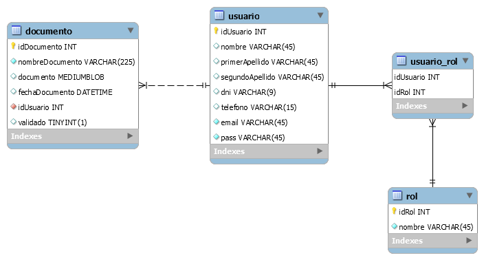

# Diagrama de Flujo


# Esquema de Bases de Datos (Diagrama E/R)

La base de datos dispone de tres tablas que representan las entidades de Usuario, Documento y Rol. Tiene, además, otras dos tablas que relacionan al usuario con los documentos almacenados y al usuario con los roles. Está diseñada para que pueda modificarse en un futuro el número máximo de documentos que un usuario puede subir, o la cantidad de roles que un usuario puede tener, por si esto fuera necesario más adelante.



# Tecnologías a utilizar

## PHP

PHP es un lenguaje de programación de uso general adaptado especialmente al desarrollo web. PHP, además, puede combinarse con MySQL para trabajar con bases de datos.

Uno de los principales objetivos de nuestro proyecto es la introducción de datos usando un formulario en una base de datos que hemos creado usando MySQL, y PHP es el principal lenguaje usado para tratar con formularios en HTML y como se ha mencionado previamente, tiene soporte nativo con MySQL. PHP además dispone de una amplia documentación, lo cual fue especialmente útil teniendo en cuenta nuestra falta de experiencia con el lenguaje.

En nuestro caso usamos PHP7, que es la ultima versión de PHP y además usamos la versión “Procedural”, la cual se asemeja más a versiones anteriores de PHP, por lo cual fue más fácil adaptar la extensa documentación de anteriores versiones de PHP a nuestro programa, debido a su parecido.

Ahora vamos a ver como guardamos los datos del formulario de registro a nuestra base de datos usando PHP7 Procedural:

```php
// Comprobar los errores antes de añadir los datos a la BBDD
if (empty($nombre_err) && empty($primerapellido_err) && empty($segundoapellido_err) && empty($dni_err) && empty($telefono_err) && empty($email_err) && empty($password_err) && empty($confirm_password_err)) {
	// Declaración
    $sql = "INSERT INTO usuario (nombre, primerapellido, segundoapellido, dni, telefono, email, pass) VALUES (?, ?, ?, ?, ?, ?, ?)";

	if ($stmt = mysqli_prepare($conn, $sql)) {
	// Vincula las variables a la declaración como parámetros
	mysqli_stmt_bind_param($stmt, "sssssss", $param_nombre, $param_primerapellido, $param_segundoapellido, $param_dni, 	$param_telefono, $param_email, $param_password);
	// s significa string, hay tantas s como string hay en los parámetros

	// Establece parámetros
	$param_nombre = $nombre;
	$param_primerapellido = $primerapellido;
	$param_segundoapellido = $segundoapellido;
	$param_dni = $dni;
	$param_telefono = $telefono;
	$param_email = $email;
	$param_password = $password;	
	// Intentar ejecutar la declaración
	if (mysqli_stmt_execute($stmt)) {
                
	} else {
		echo "Algo fue mal. Vuelva a intentarlo más tarde.";
	}

	// Fin de la declaración
	mysqli_stmt_close($stmt);
	}

	$sql2 = "INSERT INTO usuario_rol (idUsuario, idRol) VALUES (LAST_INSERT_ID(), 2)";

	if ($stmt = mysqli_prepare($conn, $sql2)) {

        // Intentar ejecutar la declaración
        if (mysqli_stmt_execute($stmt)) {

            // Redirige a login 
            header("location: /index.php");

        } else {
            echo "Algo fue mal. Vuelva a intentarlo más tarde.";
        }

        // Fin de la declaración
        mysqli_stmt_close($stmt);
	}
}
```

Como podemos ver en el siguiente código, empezamos asegurándonos de que no haya ningún error en ninguno de los campos del registro. Luego seguimos estableciendo la sentencia de MySQL que vamos a usar y asignándola a “$sql”, asegurándonos así que PHP lo detecte como una sentencia de SQL. En esta sentencia le asignamos a las variables los valores “?”, esto en esencia le dice al programa que los valores son los siguientes que va a obtener.

Seguido esto reestablecemos conexión con la base de datos y le asignamos los parámetros que hemos obtenido del formulario a los valores en la tabla “usuarios” e intentamos ejecutar la sentencia. En el caso de error a la hora de ejecutar, el programa nos muestra un mensaje acorde al error.

Seguidos podemos ver la segunda parte, que es la cual se ocupa de que el rol asignado a los usuarios que se registren sea "2", que en este caso significa usuario estándar.

## PHPMailer

PHPMailer es una función de PHP que expande el soporte de la función mail() en PHP, añadiéndole la capacidad de mensajes HTML, codificación, autentificación y adjuntarían de archivos. Nuestro uso principal fue para ayudar con la creación del email ya que sus herramientas son muy útiles para crear mensajes en HTML y así poder estructurar mejor el correo.

Para la instalación de PHPMailer es necesario seguir los pasos estipulados en el siguiente enlace: https://github.com/PHPMailer/PHPMailer.

## XAMPP

XAMPP es una distribución de Apache gratuita y de software libre que consiste principalmente en el sistema de gestión de bases de datos MySQL, el servidor web Apache y los intérpretes para lenguajes de script PHP y Perl.

El principal objetivo de este proyecto es conectar una página HTML5 con una base de datos, en este caso, una creada en MySQL. Para ello decidimos que la mejor forma de conseguirlo era utilizar un simulador de servidor web que nos permitiera establecer la conexión mediante el lenguaje PHP.

Más adelante se puede encontrar un manual de instalación de XAMPP.

## MySQL

MySQL es un sistema de gestión de bases de datos relacional y esta considerada como la base de datos de código abierto más popular del mundo. Su uso en el proyecto se debe a su facilidad y nuestra experiencia previa con él, y la necesidad de guardar los datos de los usuarios en una Base de Datos para el proyecto.

Para el desarrollo de este proyecto creamos una base de datos y esta consta de cuatro tablas:

Tabla "usuario":


Tabla “rol”:


Tabla “usuario rol”:


Tabla “documento”:


Para establecer conexión entre MySQL y PHP usamos el siguiente código:

```php
long php code fihdoafhuiodfosdf
```

Este fragmento de código establece como variables el nombre del host de la base de datos, el nombre del usuario, la contraseña y el nombre de la base de datos y los usa para crear una conexión usando la función “mysqli_connect” y guardando esto en la variable “$conn”. Siguiente podemos ver como el código comprueba la conexión y establece un mensaje de error en el caso de que no se pudiera conectar a la base de datos.

Para evitar repetir el fragmento de código optamos por separarlo en su propio archivo .php llamado “connectionconfig.php” y así solo tenemos que incluir lo siguiente para conectar otros .php a las base de datos:

```php
require_once(“connectionconfig.php”);
```

A si mismo, para evitar problemas por caracteres especiales en español (tildes, ñ…) incluimos también este pequeño fragmento.

```php
mysqli_set_charset($conn, “utf8”);
```

## HTML y CSS

Para estructurar la página como es de esperar usamos HTML5. HTML es un lenguaje de marcas para la elaboración de paginas web, y HTML5 es la quinta revisión de este. HTML es con definitiva el lenguaje principal para la elaboración de páginas web y su uso fácil y amplia documentación hacen de su elección una fácil decisión. 

Para el diseño de las páginas web usamos CSS. CSS es un lenguaje de diseño gráfico para definir y crear la presentación de un documento escrito en un lenguaje de marcado (en nuestro caso HTML) aunque en nuestro caso en vez de crear nuestra propia hoja de estilos optamos por usar Bootstrap.

Bootstrap es un conjunto de herramientas de código abierto para diseño de sitios y aplicaciones web. En esencia, Bootstrap te permite usar código de CSS ya existente para diseñar tu página web simplemente asignándole un nombre especifico de clase a una etiqueta en tu código HTML.

Para usar Bootstrap en tu pagina web debes incluir las siguientes etiquetas:

```html
<link rel="stylesheet" href="https://maxcdn.bootstrapcdn.com/bootstrap/4.5.0/css/bootstrap.min.css"> 
<script src="https://ajax.googleapis.com/ajax/libs/jquery/3.5.1/jquery.min.js"></script> 
<script src="https://cdnjs.cloudflare.com/ajax/libs/popper.js/1.16.0/umd/popper.min.js"></script>
<script src="https://maxcdn.bootstrapcdn.com/bootstrap/4.5.0/js/bootstrap.min.js"></script>
```

Una vez hecho esto le asignas una clase específica a la etiqueta que quieras modificar y esta adopta el estilo ya creado.

```html
<button type="button" class="btn btn-primary">Botón</button>
```

Y esto hace que su diseño sea el siguiente:

En el caso de querer cambiar el color de boton a rojo, le hubiesemos asignado lo siguiente:

```html
<button type="button" class="btn btn-danger">Botón</button>
```

Y el botón pasa a ser rojo: 

Así mismo, Bootstrap también incluye código predeterminado en JavaScript para poder crear menús colapsables y otros aspectos del diseño de páginas web modernas.

# Manual de Instalación de XAMPP

La instalación de XAMPP es muy sencilla, para empezar, nos dirigiremos a la siguiente página: https://www.apachefriends.org/index.html en donde podemos encontrar el instalador de XAMPP. Seleccionamos la versión que necesitemos (en este caso XAMPP para Windows) y lo descargamos.

 

Una vez descargado, ejecutamos el instalador y nos puede salir un mensaje de alerta así:


Este problema como muestra el mensaje en sí, se puede solucionar fácilmente con asegurarse no instalar XAMPP en archivos de programa, sino en otro lugar que ya seleccionaremos más tarde así que le damos a OK para seguir.

El siguiente paso de la instalación importante que nos saldrá es el de seleccionar componentes a instalar:


En nuestro caso, instalamos todo por seguridad, pero lo único que debemos tener instalado es Apache, MySQL y PHP, lo demás no es necesario para lo que queremos hacer.

Una vez hecho esto, nos dará la opción de seleccionar el directorio donde queremos instalar XAMPP.

Como se ha discutido con anterioridad, en teoría esto es a libre elección del usuario, pero en el caso de que haya salido el aviso anterior, es recomendable instalarlo en C:\xampp como se muestra en la imagen de arriba.

Una vez hecho esto, le damos a “Next” hasta que nos salga la instalación, y una vez terminada le damos a “Finish”.

Una vez terminado ejecutamos “XAMPP Control Panel” como Administrador y nos debería salir una ventana así:


Como podemos ver, los servicios salen con una X roja, esto se debe a que no los hemos instalado. esto se soluciona fácilmente con tan solo hacer clic en el servicio e instalar el servicio para Apache.


Y si todo ha ido bien debería salirnos los servicios ahora como un tic verde, indicando que está instalado y funcionando correctamente.


Una vez instalado esto, podemos darle a “Start” al proceso de Apache.

Para que un proyecto se ejecute con XAMPP, tenemos que dirigirnos al directorio donde tengamos instalado XAMPP y buscar dentro de él la carpeta “htdocs”.


En esta carpeta es donde se aloja la carpeta del proyecto (en nuestro caso “manifesto”).

En cuanto a la base de datos, hemos trabajado a partir de MySQL Server y MySQL Workbench con los que ya contábamos anteriormente.

Para ver y trabajar en la base de datos, es necesario importarla. Esta se encuentra en esta carpeta bajo el nombre de ‘manifesto.sql’. XAMPP mediante Apache es el encargado de conectar los documentos .php a la base de datos mediante una configuración de conexión propia de MySQL y PHP.

Finalmente nos dirigimos a nuestro navegador y escribimos en la barra superior “localhost/manifesto” y, como podemos ver, nos muestra la página principal que ha de llamarse ‘index.php’.


Para más información visita [Manifesto](http://manifesto.epizy.com/)


